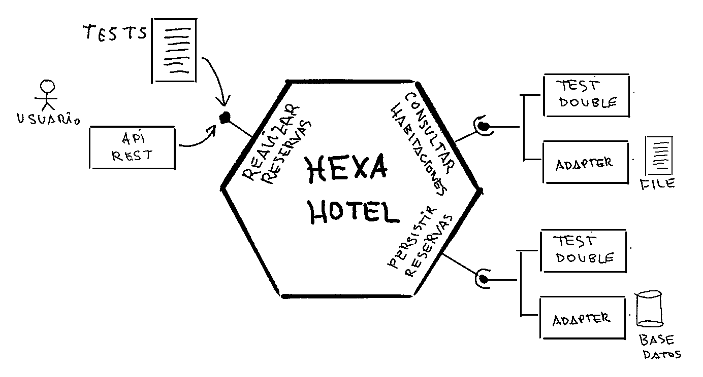

# hexa-hotel
UHU - ETSI - Taller Arquitectura Hexagonal - Ejemplo App Hexagonal desde cero

#### Entorno de desarrollo utilizado:
- Ubuntu 20.04
- Java 17
- Maven 3.9.5
- Eclipse 2023-06
- MariaDB server 10.3.38

#### Instrucciones para ejecutar la aplicación
1. Descargar el repositorio GitHub
2. Abrir un terminal de comandos e ir a la carpeta donde lo hemos descargado
3. Ejecutar el comando:
~~~
mvn clean verify
~~~
4. Ejecutar el comando:
~~~
java -jar ./target/hexa-hotel-1.0.0.jar
~~~
